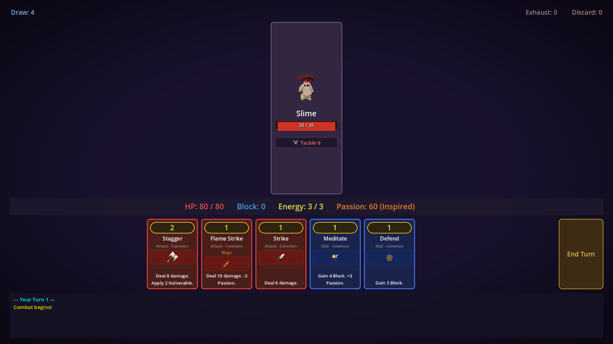
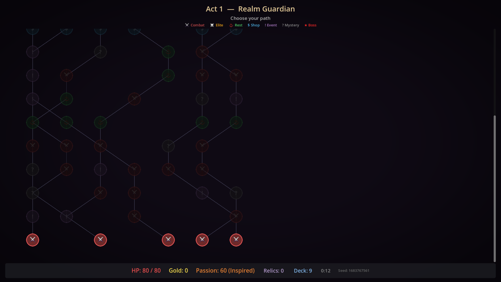
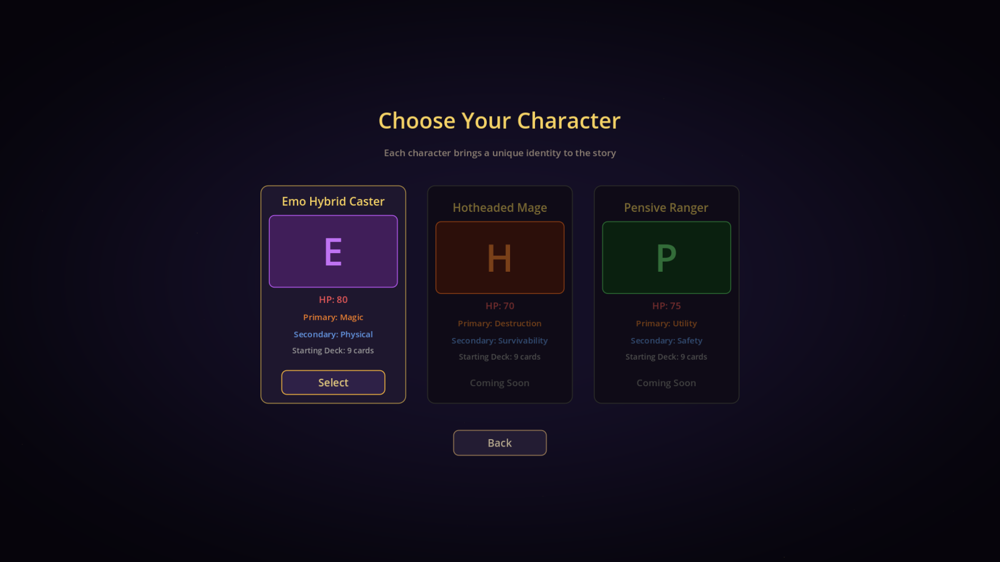
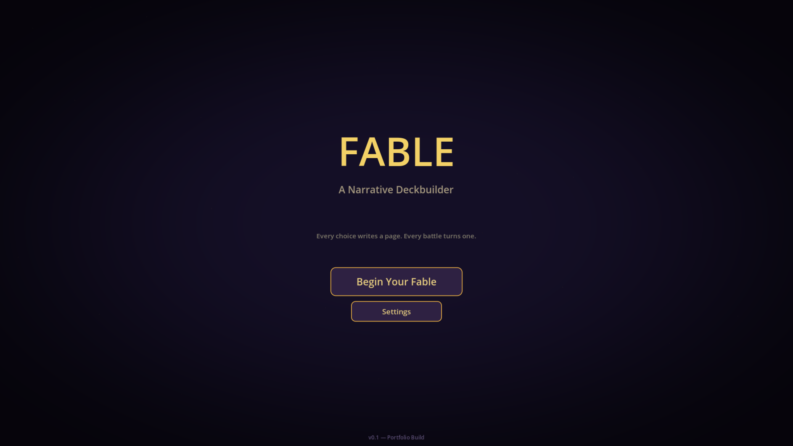

# Fable

**A narrative-driven roguelike deckbuilder built in Godot 4.**

Story choices shape gameplay. A passion system shifts characters between dual personalities, changing available cards and combat strategy mid-run. Inspired by Slay the Spire's combat loop, Fable layers narrative weight on top of tight deckbuilding mechanics.


---

## Screenshots

| | |
|---|---|
|  |  |
| Turn-based card combat with energy, status effects, and enemy intents | Procedural branching map with combat, elite, shop, rest, event, and boss nodes |
|  |  |
| Dual-personality characters with primary and secondary builds | Title screen |

---

## Systems

- **Combat Engine** -- Turn-based card combat with energy, block, draw/discard/exhaust piles, status effects, and multi-enemy encounters. Cards are composed from modular effects (damage, block, draw, status, heal, energy, passion).

- **Passion System** -- A 0-100 meter with 5 tiers (Blazing / Inspired / Steady / Wavering / Hollow). Passion shifts characters between primary and secondary personalities, affecting card rewards, zone penalties, and combat identity. Enemies can target passion with demoralization attacks.

- **Procedural Map** -- Slay the Spire-style branching node maps generated per act. Node types: combat, elite, rest, shop, event, mystery, and boss. 3-act structure with unique bosses and scaling difficulty.

- **Card Reward Economy** -- Tier-based card distribution. Passion level determines the split between personality-specific and generic card offers. 34+ cards across generic, primary, and secondary pools with Common / Uncommon / Rare tiers.

- **Relics & Shop** -- 18 relics with trigger-based activation (combat start, turn start, combat end, on pickup). Shop sells cards and relics, and offers deck thinning.

- **Narrative Events** -- 8 branching events with choices that affect HP, gold, cards, relics, and passion. Events validate affordability and handle edge cases (death from HP loss, insufficient gold).

- **Card Upgrades** -- Rest sites offer heal or upgrade. Upgrades use per-card override effects or generic stat boosts. Preview shows before/after stats.

---

## Architecture

```
scenes/
  combat/        Combat scene -- card hand, enemy panels, pile viewers, combat log
  map/           Procedural map with node navigation and run stats
  shop/          Card and relic purchasing, deck thinning
  rest/           Heal or upgrade a card
  event/          Narrative choices with branching outcomes
  reward/         Post-combat card and relic selection
  act/            Act transitions and victory screen
  character_select/
  title/
  settings/
  splash/
  game_over/

scripts/
  autoloads/     Events (signal bus), RngManager, RunManager, AudioManager,
                 SceneTransition, PauseMenu
  core/          CardData, CombatEngine, PassionState, CombatantStats,
                 PileManager, MapGenerator, CardPool, RelicPool, EventPool,
                 EnemyData, StatusEffects
  core/effects/  Composable card effects -- DamageEffect, BlockEffect,
                 DrawEffect, PassionEffect, StatusApplyEffect, HealEffect,
                 EnergyEffect

docs/            Game design doc, architecture rationale, implementation guide
```

### Key Patterns

- **Composable effects** -- Cards are arrays of `CardEffect` subclasses. A card can deal damage, apply a status, and draw cards in a single play. Enemy moves reuse the same effect system.

- **Signal bus** -- `Events` autoload with typed signals organized by domain. Decouples combat, UI, and state management.

- **Three-layer state** -- `RunManager` (persistent run data), `CombatantStats` (per-combatant HP/block/statuses), `CombatEngine` (battle state machine and turn flow).

- **Deterministic RNG** -- `RngManager` maintains separate seeded tracks for deck shuffling, enemy behavior, loot generation, events, and map generation. Runs are reproducible from a seed.

- **Combat state machine** -- `CombatEngine` manages turn phases (player turn, enemy turn, win/loss checks) with status effect tick timing (start-of-turn vs end-of-turn).

---

## Running the Project

1. Install [Godot 4.4](https://godotengine.org/download/)
2. Clone the repository
3. Open the project in the Godot editor (`project.godot`)
4. Press F5 or click Play

---

## Status

**Early development -- core scaffolding.**

The full gameplay loop is functional: title > character select > map navigation > combat > rewards > shop > rest > events > boss > act transitions > victory. One playable character (Emo Hybrid Caster) with 34+ cards, 18 relics, and 8 narrative events. Audio, visual polish, and UX are in place.

Still ahead: two additional characters, narrative content (visual novel segments, realm configuration), balance tuning, perks system UI, and real art/audio assets.

---

## License

[MIT](LICENSE)
